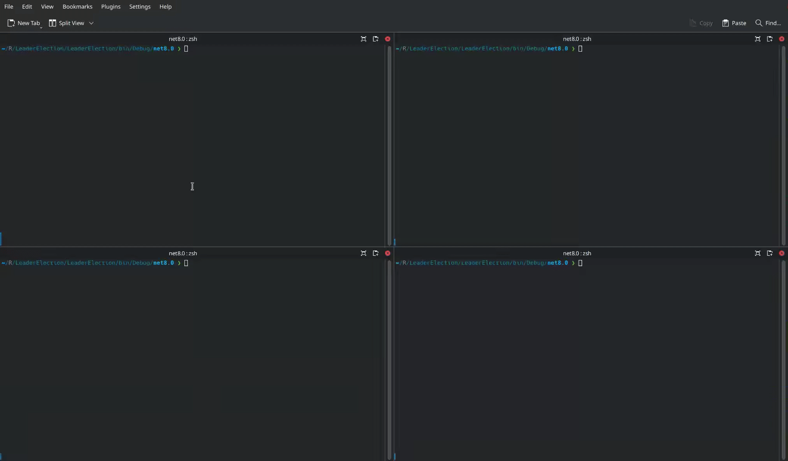

# Leader Election using .NET and Etcd

This is a sample project that implements a leader election mechanism using Etcd. The leader election algorithm ensures that among a set of nodes, one node acts as the leader, while the others remain followers. The project is written in C# and utilizes gRPC for communication with the Etcd cluster.

## How Leader Election works?
1. **Node Registration:** Each node registers itself in the Etcd cluster by creating a key with a unique ID under a common prefix (e.g. `election/`)
2. **Leader Determintation:** 
    * The node with the smallest revision number in the Etcd cluster bcomes the leader.
    * All other nodes monitor the node with the previous revision number to avoid a "herd effect", where all nodes try to become the leader simultaneously.
3. **Key Watching:** Nodes watch their own key and the key of the node that they are tracking. If the watched key is updated or deleted, the leader election is re-run.

## Example

## License
This project is primarily licensed under the MIT License. However, it includes certain files (e.g., proto files) that are licensed under the Apache License 2.0. For more information, see the LICENSE file.